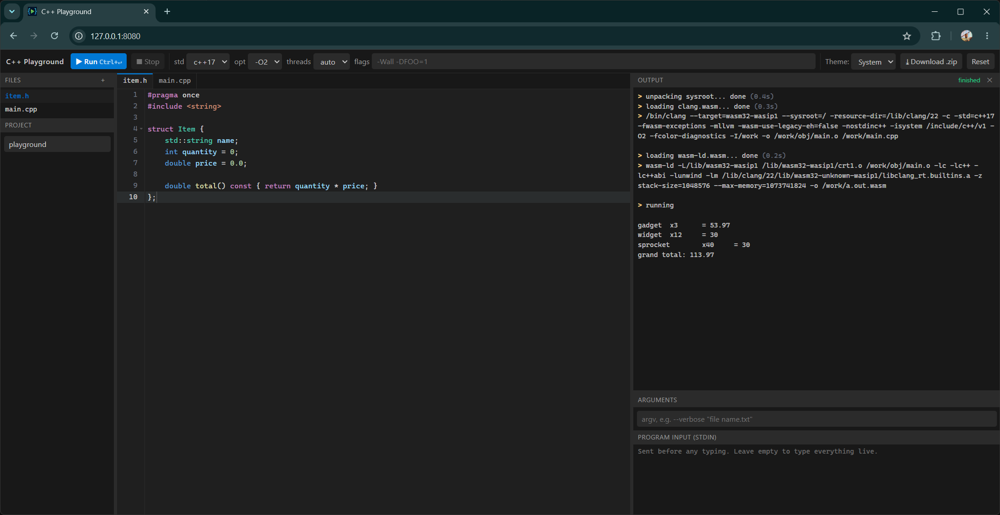
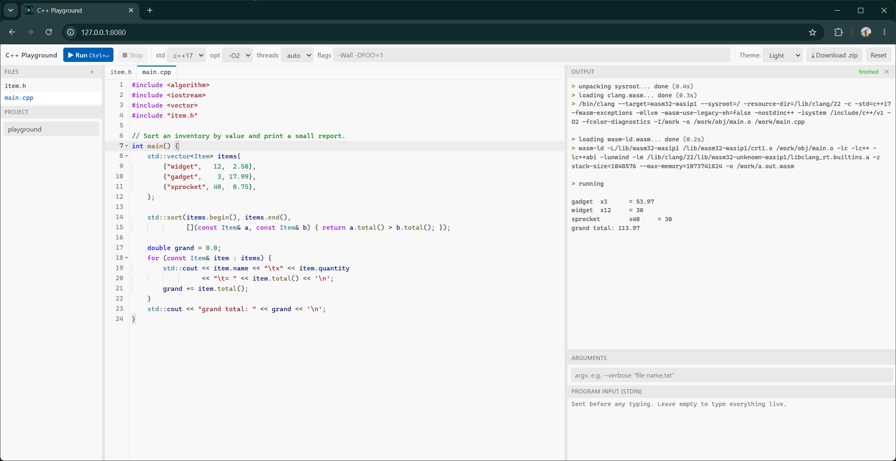
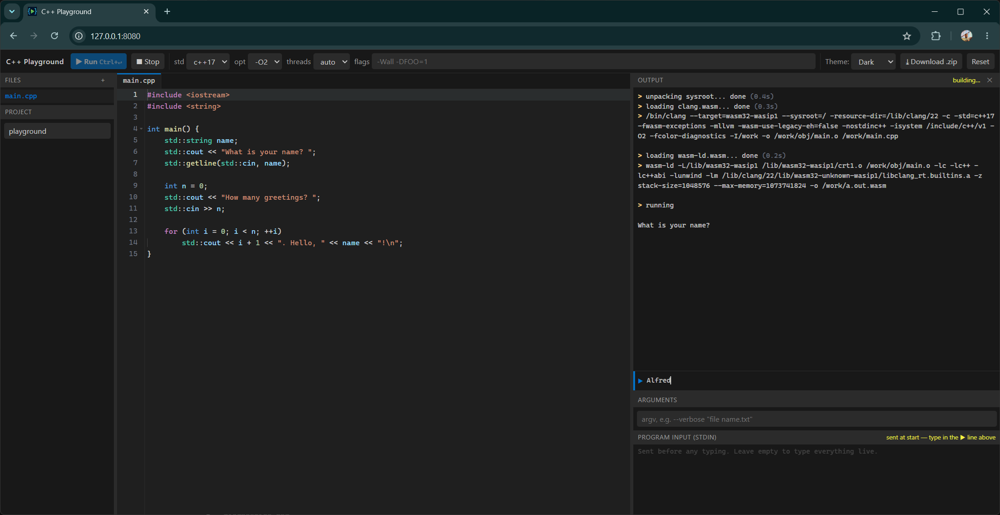
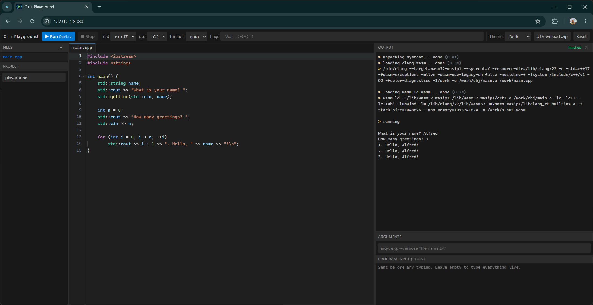
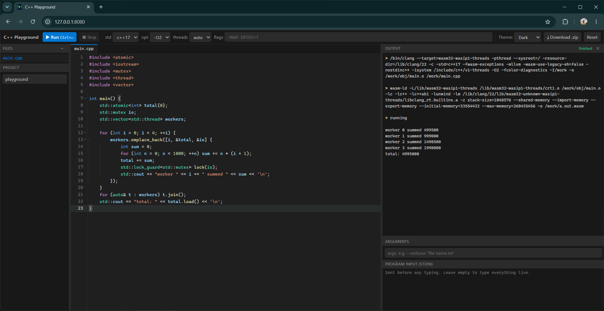
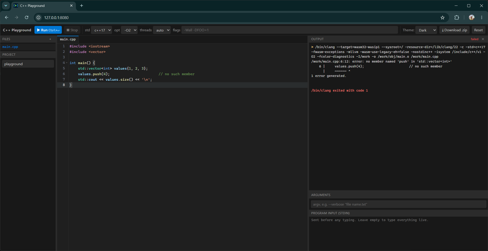

# C++ Playground (self-hosted)

[](https://github.com/simfeo/CppPlaygroundSelfHosted/actions/workflows/ci.yml)
[](https://github.com/simfeo/CppPlaygroundSelfHosted/releases/latest)
[](LICENSE)
[](tools/toolchain/build_wasm_clang.sh)

A complete C++ toolchain that runs in your browser. **Clang 23.1.1, wasm-ld and
libc++ are themselves WebAssembly binaries**, so your code is compiled, linked
and executed entirely on the client — with threads, exceptions and interactive
input. No server-side compiler, no accounts, and it keeps working offline once
the page has loaded.

## Screenshots

Multi-file project, dark theme — the output pane shows the exact clang and
wasm-ld command lines each run used:



The same project in the light theme, with Tree-sitter highlighting in VS Code's
Light+ colours:



Interactive stdin: the program blocks in `std::getline`, and you type your
answer straight into the console.




`std::thread` on real Web Workers over one shared memory — note `-pthread` and
`--shared-memory` appearing automatically, because *threads* is set to *auto*:



Clang's own diagnostics, colours and carets included:



## Quick start

Download the [latest release](https://github.com/simfeo/CppPlaygroundSelfHosted/releases/latest),
unpack it, and run the server:

```bash
python serve.py
```

Or from a clone, which is the same thing plus the sources:

```bash
git clone https://github.com/simfeo/CppPlaygroundSelfHosted
cd CppPlaygroundSelfHosted
python serve.py
```

Open <http://localhost:8080/>. That is all — no build step, no compiler, no
dependencies beyond Python 3. The prebuilt toolchain ships in `dist/vendor/`,
so a clone is immediately runnable (and is therefore ~45 MB).

To deploy it somewhere else, copy `dist/` onto any static web server. It works
offline once loaded.

## Features

- **Clang 23.1.1** targeting `wasm32-wasip1`, built from source (see below)
- C++ syntax highlighting from a real parser (Tree-sitter), in VS Code's
  Dark+ colours: types, calls, members, parameters and macros are distinguished
- Multi-file projects (sources + headers, subdirectories supported)
- `-std=c++11/14/17/20/23/26`, `-O0..-O3/-Os`, plus free-form extra flags
- Full C++ standard library: libc++ built from the same LLVM release
- **Working exceptions**, using the standardized wasm EH opcodes
- stdout/stderr console with clang's colored diagnostics
- **A source-level debugger**: breakpoints in the gutter, step over / into /
  out, a call stack you can click through, and local variables with their real
  types, expanded member by member. It runs in the page; no extension, no
  external debugger
- **Crash backtraces**: a trap prints the call stack with demangled names and
  `file:line:column`, read from the module's own name section and DWARF line
  table. An uncaught exception reports its type and `what()` plus the stack at
  the `throw`, not at the point it escaped
- **Threads**: `std::thread` runs on real Web Workers sharing one memory, with
  working mutexes and atomics. The *threads* selector defaults to *auto*, which
  builds with `-pthread` only when the code uses threads
- Interactive stdin: programs block on `std::cin` and you type into the console,
  with Ctrl+D for end of input; the *Program input* box preloads text before that
- Command line arguments, quoted like a shell (`--flag "two words"`)
- Dark and light themes (VS Code Dark+ / Light+), or follow the OS setting
- Stop button for runaway programs; resizable panes in both directions (drag a
  splitter, double-click one to reset)
- Export the project as a `.zip` containing a real, buildable `CMakeLists.txt`
- An *About* dialog with help, the keyboard shortcuts, and links to the source
  and the release archive, so a hosted copy tells visitors how to run their own
- Project state is kept in `localStorage`

Download size is ~35 MB: clang 17.4 MB, wasm-ld 10.2 MB, sysroot 7.4 MB, all
gzipped and inflated in the browser.

## Why a server at all

Browsers refuse to load Web Workers and `fetch()` wasm from `file://`, so
opening `dist/index.html` directly does not work — the files have to come over
HTTP. `serve.py` is a plain static file server; `python -m http.server 8080
--directory dist` or nginx would do as well.

The server never sees or compiles your code. It hands over files and goes back
to sleep; clang runs in your browser, and the page keeps working if you kill the
network after it loads.

### Cross-origin isolation

Interactive stdin and `std::thread` both need `SharedArrayBuffer`, which needs
the page to be cross-origin isolated, which needs two response headers.
`serve.py` sends them:

    Cross-Origin-Opener-Policy: same-origin
    Cross-Origin-Embedder-Policy: require-corp

Static hosts usually do not. Serve `dist/` from something that sends them, or
the playground will say so and fall back to the preloaded input box,
single-threaded — everything else still works.

## Developing

`dist/` is committed, so only touch this if you change the app. After editing
`src/`, copy it over:

```bash
python tools/build.py
```

That refreshes the HTML/CSS/JS in `dist/` and leaves `dist/vendor/` (the
compiler binaries) untouched.

### Rebuilding the toolchain

Linux (WSL is fine), **no Docker**. Needs cmake, ninja, a C++17 host compiler,
curl, ~5 GB disk and about an hour on 16 cores:

```bash
sudo apt install -y cmake ninja-build build-essential curl xz-utils patch python3
export WASI_SDK_PREFIX=$HOME/wasm-clang/wasi-sdk
bash tools/toolchain/build_wasm_clang.sh ~/wasm-clang
```

Keep the work directory on a real Linux filesystem. Building under `/mnt/c` or
`/mnt/d` from WSL works but is several times slower.

`WASI_SDK_PREFIX` has to be exported, not just passed to cmake: the threads
runtimes use `tools/toolchain/wasi-sdk-p1-threads.cmake`, and cmake does not
pass `-D` cache variables down into the `try_compile` it uses to probe the
compiler. Without it that half fails at configure time with
`set WASI_SDK_PREFIX (env or -D) to the wasi-sdk path`.

That downloads wasi-sdk 33 and the LLVM release, applies the patches in
`tools/toolchain/patches/`, builds native tblgen, then cross-compiles clang and
lld to `wasm32-wasi`. It also rebuilds libc++/libc++abi/libunwind, because
wasi-sdk's prebuilt C++ libraries use the *legacy* wasm exception opcodes and
browsers reject a module mixing those with the standardized ones clang emits.

Then pack the sysroot and install the result into `dist/vendor/`:

```bash
python3 tools/pack_sysroot.py --wasi-sdk ~/wasm-clang/wasi-sdk \
    --runtimes ~/wasm-clang/runtimes \
    --runtimes-threads ~/wasm-clang/runtimes-threads \
    -o ~/wasm-clang/out/sysroot.tar.gz
python3 tools/build.py --toolchain ~/wasm-clang/out
```

Re-running the build script is incremental: downloads and the source tree are
reused, patches are applied through a dry-run check so they are idempotent, and
ninja rebuilds only what changed.

Finally serve it and check by hand. The four things worth compiling, because
each exercises a different part of the toolchain: a program using a recent
standard library feature, one that throws and does not catch (exceptions plus
the symbolized backtrace), one using `std::thread` (the separate threads
runtime), and one run under the debugger with a `std::string` and a
`std::vector` in scope (the DWARF reader and the libc++ formatters).

### Upgrading LLVM

The version lives in one variable at the top of
`tools/toolchain/build_wasm_clang.sh`, overridable from the environment:

```bash
LLVM_VERSION=24.1.0 bash tools/toolchain/build_wasm_clang.sh ~/wasm-clang
```

**Delete the old source tree first.** The script only downloads when
`$WORK/llvm-project` is missing, and neither that directory nor the cached
`$WORK/dl/llvm.tar.xz` carries a version in its name. Change the version
without clearing them and it prints the new version, reports every patch as
"already applied", and cheerfully rebuilds the *old* compiler:

```bash
cd ~/wasm-clang
rm -rf llvm-project build-native build-wasm build-runtimes build-runtimes-threads \
       runtimes runtimes-threads out dl/llvm.tar.xz
```

(Rename rather than `rm` if you want to keep the previous compiler around.)
Leave `wasi-sdk` and `dl/wasi-sdk.tar.gz` alone unless you are also changing
`WASI_SDK_VERSION`.

Then expect to deal with three kinds of breakage, in the order they appear:

1. **A patch no longer applies.** The script stops with
   `ERROR: <name> does not apply to llvm-project <version>`. Regenerate it with
   `patchgen.py`, which diffs against the tree you actually have:

   ```bash
   python3 tools/toolchain/patchgen.py ~/wasm-clang/llvm-project \
       llvm/lib/Support/Whatever.cpp 000N-name.patch <<'EOF'
   text to find
   ---
   text to put there instead
   EOF
   ```

   It refuses unless the search text occurs exactly once, so give it enough
   context to be unique.

2. **A patch applies but no longer *fits*.** Worse than the first case, because
   nothing complains until the link fails with an undefined symbol. This
   happened going from 22 to 23: patch 0001 defines a no-op
   `installExceptionOrSignalHandlers` for WASI, and LLVM 23 gave that function a
   `bool` parameter, so the patch cleanly defined an overload nobody called. Fix
   is the same: reverse it (`patch -d ~/wasm-clang/llvm-project -p1 -R -i <patch>`),
   then regenerate with the new signature.

3. **libc++ stops building for WASI.** Its locale layer is mid-refactor
   upstream, and WASI has no dedicated backend, so it lands in a fallback that
   is not always kept working. Patch 0010 is exactly this: libc++ 23 made the
   z/OS locale shim unconditional, and it redeclares `strtod_l`, `strtof_l`,
   `strtold_l` and `vasprintf`, which wasi-libc already declares, giving dozens
   of `cannot add 'abi_tag' attribute in a redeclaration` errors.

Check the result really is the version you asked for, since the traps above are
all silent:

```bash
grep LLVM_VERSION_ ~/wasm-clang/llvm-project/cmake/Modules/LLVMVersion.cmake
```

One mismatch is expected and harmless: the sysroot's resource directory
(builtin headers and `libclang_rt.builtins.a`) comes from wasi-sdk, so it stays
at wasi-sdk's clang major while the compiler moves ahead. `pack_sysroot.py`
prints it as `clang resource version: NN`, and `worker.js` discovers whatever
directory is there rather than assuming a number.

### Adding a language standard

When a new standard shows up, say C++29, it is two lines in `src/index.html`:

```html
<select id="selStd">
  ...
  <option>c++26</option>
  <option>c++29</option>
</select>
```

Then `python tools/build.py` to copy it into `dist/`. Nothing else needs
touching: the selector's value is passed straight through as `-std=<value>` in
`worker.js`, and `cmake.js` strips the `c++` prefix to get
`CMAKE_CXX_STANDARD`. The pinned C++17 in `worker.js` is the throw shim, which
is built separately and deliberately does not follow the toolbar.

Check the compiler actually accepts it before adding the entry, since clang
takes the flag only once it knows the name:

```bash
grep -ao 'c++2[0-9a-z]' dist/vendor/clang.wasm.gz  # after gunzip, or:
echo 'int main(){}' | clang -std=c++29 -x c++ - -o /dev/null
```

Adding an entry clang does not know produces `invalid value 'c++29' in
'-std=c++29'` on every compile, so it is worth the ten seconds.

### What the port needed

wasi-libc has no processes, signals, sockets or file locking, and LLVM assumes
all of them. Two mechanisms bridge that:

- `tools/toolchain/wasi-shim/` — missing headers (`pwd.h`, `sys/wait.h`) plus
  types and failing stubs for `fork`/`exec`, `sigaction`, rlimits, `dladdr` and
  friends, force-included into every translation unit. LLVM already handles
  these calls failing, so ENOSYS is both honest and sufficient.
- `tools/toolchain/patches/` — ten small patches where behaviour genuinely has
  to change. Two of them fix an upstream bug: LLVM and clang test `__WASM__`,
  but the macro clang actually defines is `__wasm__`, so the ABI-annotation
  macros end up undefined on wasm and headers fail to parse. The tenth keeps
  libc++ from including its z/OS locale shim on WASI, where wasi-libc already
  declares the functions the shim defines.

`tools/toolchain/wasi-shim/eh_tag.s` deserves a note: with legacy EH, libunwind
happened to define the `__cpp_exception` tag, so wasi-sdk's prebuilt archive
carries it. With standard EH every object only imports the tag and nothing
defines it, so anything that throws fails to link. A wasm tag can't be expressed
in C, hence three lines of assembly, archived into our `libunwind.a`.

## Layout

```
serve.py             static server with COOP/COEP — run this to use the app
.github/workflows/   CI and release packaging
docs/                README screenshots
dist/                committed, runnable output: the app + vendor/ toolchain
src/                 the app sources (plain HTML/CSS/JS, no build step, no deps)
  index.html
  css/app.css
  js/app.js          UI: files, tabs, editor, console, zip export
  js/worker.js       compile/link/run driver
  js/wasi.js         WASI preview1 host with an in-memory filesystem
  js/debuginfo.js    name section + DWARF line table reader, demangler,
                     backtrace formatter
  js/dwarfinfo.js    DWARF .debug_info reader: functions, variables, types,
                     and reading their values out of the program's memory
  js/dbgrewrite.js   splices stop points into the linked module
  js/dbgsession.js   the worker's half of the debugger: stopping and stepping
  js/debugger.js     the page's half: breakpoints and commands
  js/tar.js          tar reader + gzip inflate
  js/panels.js       draggable splitters between the panes
  js/thread-worker.js  one spawned thread of a wasi-threads program
  js/stdin-channel.js  blocking stdin handoff to the worker
  js/zip.js          minimal store-only ZIP writer
  js/cmake.js        CMakeLists.txt / README generator for exports
  js/ts-highlight.js Tree-sitter highlighting, plugged into Ace's tokenizer
  js/ace-theme-vscode.js  VS Code Dark+ theme for Ace (ours)
  queries/           our highlight query refinements
  vendor/ace/        vendored Ace editor (BSD-3, see its README)
  vendor/tree-sitter/  vendored parser + C/C++ grammar (MIT, see its README)
runtime/
  throw_shim.cpp     linked into every program via --wrap=__cxa_throw, so a
                     throw is reported while its stack is still standing
tools/
  build.py           copies src/ into dist/
  pack_sysroot.py    builds sysroot.tar.gz
  toolchain/         sources for building clang (script, patches, posix shim)
```

The browser side has no third-party code: `js/wasi.js` is our own WASI host, and
clang talks to it over the standard `wasi_snapshot_preview1` ABI.

## Exported projects

*Download .zip* produces:

```
<project>/
  CMakeLists.txt     generated: sources, include dirs, standard, extra flags
  README.md
  <your files>
```

Build it with a normal native toolchain:

```bash
cmake -S . -B build
cmake --build build --config Release
```

## Limitations

- **Interactive stdin needs a cross-origin isolated server**, because blocking a
  worker for input requires SharedArrayBuffer. `serve.py` sends the necessary
  COOP/COEP headers; on a server that does not, the playground says so and falls
  back to the preloaded input box.
- **Threads need a cross-origin isolated server**: shared memory cannot be handed
  to a worker without it (`DataCloneError`), so on a plain static host the
  playground says so and builds single-threaded. They are not on by default
  because they also cost ~12% binary size and make single-threaded code pay for
  atomic refcounts, so *auto* enables them only for code that uses them.
  A spawned thread can write to stdout but cannot touch the in-memory
  filesystem: that lives in the run worker's heap and does not cross workers.
  `std::thread::hardware_concurrency()` reports 1, which is what wasi-libc says.
- **No networking** in compiled programs.
- **Backtraces need V8** (Chrome, Edge). They are built from the wasm frames in
  a JS stack trace, which other engines do not yet provide; elsewhere a crash
  still reports its cause, just without the stack.
- A throw on a spawned thread reports its type and message, but not a stack:
  the debug sections live with the run worker and do not cross workers.
- **The debugger needs a cross-origin isolated server**, for the same reason
  interactive stdin does: stopping the program parks its worker in
  `Atomics.wait`, which needs SharedArrayBuffer.
- **Debug builds are always `-O0 -g`**, whatever the toolbar says. At any higher
  level the variables are in wasm locals or gone altogether, and neither can be
  read back.
- **Threads cannot be debugged yet**: every thread would need its own stop
  points and its own control block. Debug runs are built single-threaded.
- A variable whose *value* the compiler put in a wasm local reads as
  `<value is in a wasm local>`. Nothing outside a module can read another
  frame's locals, so this is a limit of WebAssembly rather than of the reader.
  Variables merely *addressed* through a local, such as a struct passed by
  value, are read normally: the program reports the address on its way past.
- Only your own files carry stop points, so stepping does not descend into
  libc++. There is no expression evaluation or watch window.
- Exceptions need a browser with the standardized wasm EH proposal (Chrome 95+,
  Firefox 131+, Safari 18.4+).
- The generated `CMakeLists.txt` targets a native compiler, not the in-browser
  one, so anything relying on wasm-specific behaviour may need adjusting.
- First run downloads ~35 MB of toolchain and caches it in the browser.

## Licenses

The Ace editor (`src/vendor/ace/`) is BSD-3-Clause, Copyright (c) 2010 Ajax.org
B.V. Tree-sitter and the C/C++ grammars (`src/vendor/tree-sitter/`) are MIT.
All their licenses are retained verbatim alongside the files.

Clang, LLD, libc++ and libunwind are Apache-2.0 with the LLVM exception. The
wasi-sysroot components are from wasi-sdk (Apache-2.0 / MIT).

Everything else - `src/`, `tools/` and `serve.py` - is this project's own code,
MIT licensed; see `LICENSE`.
